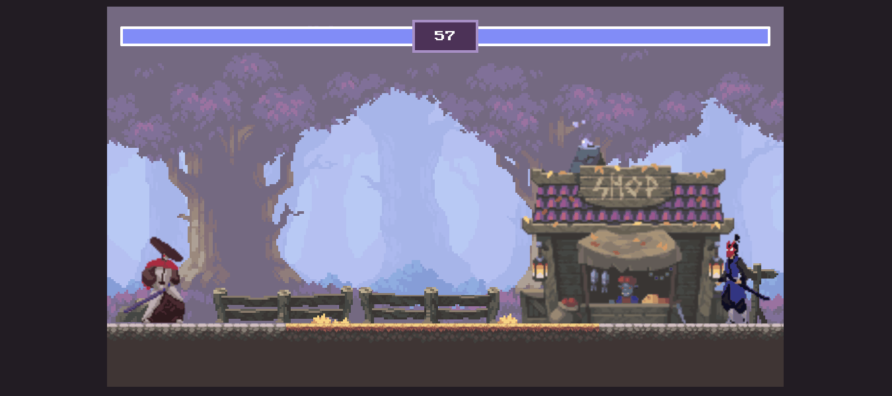
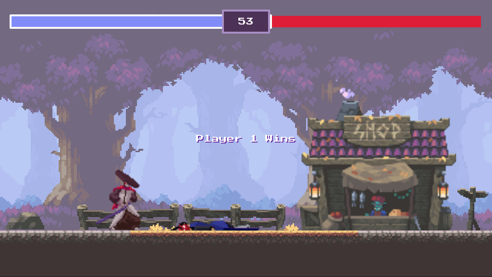

# It's Over When It's Over - Javascript Fighting Game

This is a javascript study made following [Chris Course](https://www.youtube.com/c/ChrisCourses) tutorial with HTML
Canvas. I also went ahead and made some improvements for the game.



## Table of contents

- [Overview](#overview)
    - [The game](#the-game)
    - [Screenshot](#screenshot)
    - [Links](#links)
- [My process](#my-process)
    - [Built with](#built-with)
    - [Improvements](#improvements)

## Overview

### The game

Players should be able to:

- Move across the screen
- Attack
- Take damage

### Screenshot



### Links

- Course: [JavaScript Fighting Game Tutorial with HTML Canvas](https://youtu.be/vyqbNFMDRGQ)
- Live Site URL: [It's Over When It's Over](https://mika-marcondes.github.io/fighting-game/)

## My process

### Built with

- Semantic HTML5 markup
- CSS custom properties
- Flexbox
- Javascript
- [Gsap](https://cdnjs.com/libraries/gsap) - For the health bar animation

### Improvements

- **Jump limit**

  ```js
  case
  'w'
  :
  if (player.velocity.y === 0) {
      player.velocity.y = -20
  }
  break
  ```

In the original project, the player was able to jump many times. By adding an if statement within the keydown event
listener is possible to limit the player velocity, so they can only jump once.

- **Invisible wall**

  ```js
  if (player.position.x < 0 && player.lastKey === 'a') {
      keys.a.pressed = false
  } else if (player.position.x > 973 && player.lastKey === 'd') {
      keys.d.pressed = false
  }
  ```

Another improvement consisted on disabling the player movement when they reach a certain limit on screen, creating a feeling of having an "invisible wall".

- **User Interface**


_Tutorial interface_
 


_My interface_
 


For the UI I decided to make some small changes on the color, the border style, and the colors on the timer to better fit with the game overall art-style.


